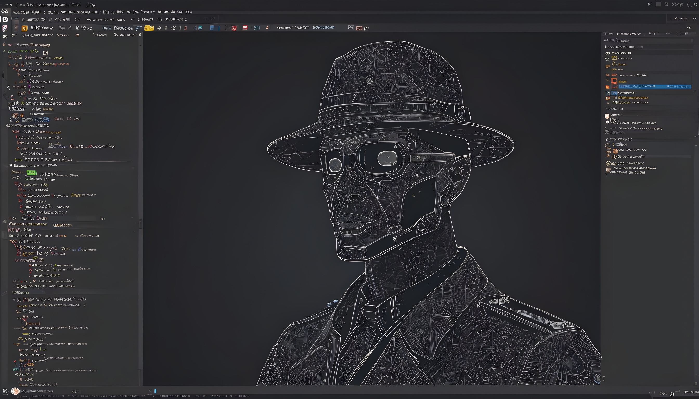
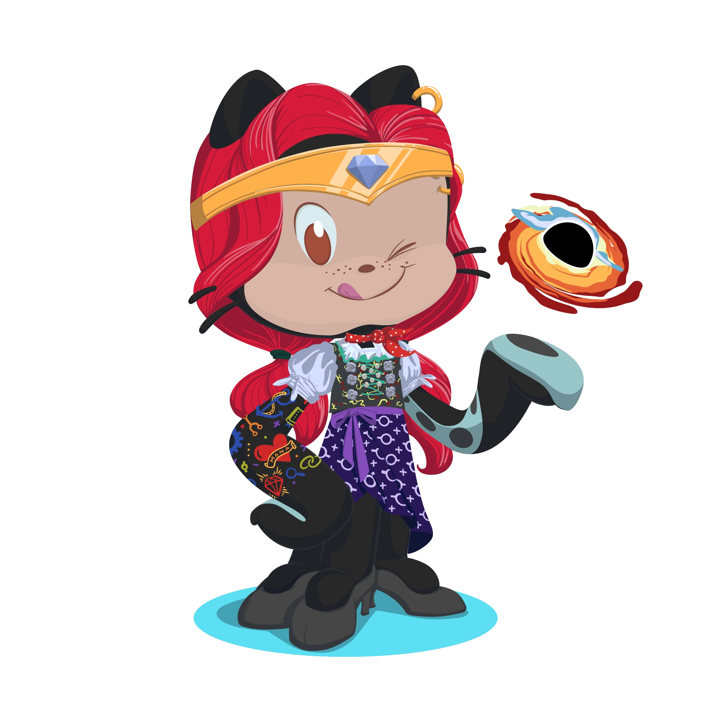

    <h1>
        Hey, I am Jerom 
        
    </h1>
    
      
    <h4>The  canonical, "Python is a great first language", elicited, "Python is a great last language!" - Noah Spurrier </h4>

 

    
  <h2>  About me</h2>
       
      

          <ul>
              <li>
                  🐍 Let's talk about Python 
              </li>
              <li>
                  🗽 Building with Django and REST framework
              </li>
              <li>
                  ⛺ Machine Learning Explorer
              </li>
              <li>
                  📫 How to reach me - <a href="mailto:jeromjomanthara@gmail.com" target="_blank">jeromjomanthara@gmail.com</a>
              </li>
          </ul>
      

     
        <h2 >  Connect with me:</h2>
         
        

            
            
            
            
        

<h2 >  Languages and Tools:</h2>

    

 

    
    
    
    
     
    
    
    
    
     
    
    
    
    
     
    
    
    
    
     
    
    
    
    
     
    
    
    
    
     
    
    
    
    
     
    
    
    
    
     
    
    
    
    
     
    
    
    
    
     

 

        <h2>&nbsp;My Stats
        </h2>
    

    

        
    

     
    

            

                
                
            
  

  

    

 
<h2 align="center">  GitHub Achievements:</h2>

 

